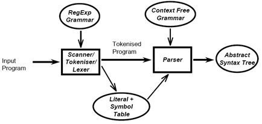

# commands on terminal in order to run the program file.
##### **Step 1:**  lex filename.l or lex filename.lex depending on the extension file is saved with
##### **Step 2:**  gcc lex.yy.c
##### **Step 3:**  ./a.out
##### **Step 4:**  Provide the input to program (here copy the test code and paste in the terminal)

## Aim

To design and implement a lexical analyser using lex for a subset of the C language.

## Features supported

1. Variable data types - int, char along with its sub types - short, long, signed, unsigned.
2. Looping constructs - while loops along with nested while loops.
3. Identification and classification of tokens.
4. Identification of functions accepting a single parameter.
5. Maintenance of a symbol table and a constant table using hashing techniques.
6. Error detection for multi-line comments and nested comments that are not terminated before the end of the program.

Checking for strings that does not end before the end of a statement and displaying corresponding error message.

## Nature of output

1. Error messages for the errors handled.
2. The token will be displayed along with the type:
  - Keyword
  - Identifier

- Literal

- Operator
- Punctuator
- Symbol table
- Constant table

# Introduction

## Lexical Analysis
In computer science, lexical analysis is the process of converting a sequence of characters (such as in a computer program or web page) into a sequence of tokens (strings with an identified &quot;meaning&quot;). A program that performs lexical analysis may be called a lexer, tokenizer, or scanner (though &quot;scanner&quot; is also used to refer to the first stage of a lexer). Such a lexer is generally combined with a parser, which together analyze the syntax of programming languages, web pages, and so forth.

## Flex Script
The script written by us is a program that generates lexical analyzers (&quot;scanners&quot; or &quot;lexers&quot;). Lex reads an input stream specifying the lexical analyzer and outputs source code implementing the lexer in the C programming language. The structure of our flex script is intentionally similar to that of a yacc file; files are divided into three sections, separated by lines that contain only two percent signs, as follows:

##### _ **Definition section** _ 
##### _ **%%** _
##### _ **Rules section** _
##### _ **%%** _
##### _ **C code section** _

The definition section defines macros and imports header files written in C. It is also possible to write any C code here, which will be copied verbatim into the generated source file. The rules section associates regular expression patterns with C statements. When the lexer sees text in the input matching a given pattern, it will execute the associated C code. The C code section contains C statements and functions that are copied verbatim to the generated source file. These statements presumably contain code called by the rules in the rules section. In large programs it is more convenient to place this code in a separate file linked in at compile time.

## C Program
This section describes the input C program which is fed to the flex script in order to generate the lex file after taking all the rules mentioned in account. Finally, a file called lex.yy.c is generated, which when executed recognizes the tokens present in the C program which was given as an input. Lexical analysis only takes care of parsing the tokens and identifying their type. For this reason, we have assumed the C program to be syntactically correct and we generate the stream of tokens as well as the symbol table from it.

# Design of Programs

## Flow

##

 

 Lexical Analyzer generates the tokenized program and symbol table for the input C program.

## Code
Lex Code : (scanner.l file)

 ##### https://github.com/CO17335/Lexical-Analyser-for-a-subset-of-the-C-language/blob/master/scanner.l

# Explanation

## Files :

1. scanner.l : Lex file which generates the stream of tokens and symbol table.
2. test.c : The input C program

The flex script recognises the following classes of tokens from the input:

- Pre-processor instructions
Statements processed : 
##### #include\&lt;stdio.h\&gt;,
##### #define var1 var2 
##### Token generated : Header / Preprocessor Directive

- Single-line comments
##### Statements processed : //...........
##### Token generated : Single Line Comment

- Multi-line comments
##### Statements processed : /\*...........\*/, /\*.../\*...\*/

##### Token generated : Multi Line Comment

- Errors for unmatched comments

##### Statements processed : /\*.......... 

##### Token generated : Error with line number

- Errors for nested comments

##### Statements processed : /\*....../\*....\*/....\*/

##### Token generated : Error with line number

- Parentheses (all types)

##### Statements processed : (..), {..}, [..] (without errors) 

##### (..)..), {..}..}, [..]..], (..., {..., [... (with errors) 

##### Tokens generated : Parenthesis (without error) / Error with line number (with error)

- Operators

- Literals
Statements processed : int, float Tokens generated : Keyword

- Errors for incomplete strings
Statements processed : char a[]= &quot;abcd Tokens generated : Error Incomplete string and line number

- Keywords
Statements processed : if, else, void, while, do, int, float, break, return and so on. Tokens generated : Keyword

- Identifiers
Statements processed : a, abc, a\_b, a12b4 Tokens generated : Identifier

## Test Case :

- Identification of user defined functions
- Identification of string literals

### Code:

#include\&lt;stdio.h\&gt;

int square(int a) { return(a\*a); }

int main() { int num=2; int num2 = square(num);

printf(&quot;Square of %d is %d&quot;, num, num2);

return 0; }

### Output :
 

## Implementation

- The Regular Expressions for most of the features of C are fairly straightforward.
However, a few features require a significant amount of thought, such as:
- The Regex for Identifiers: The lexer must correctly recognize all valid identifiers in C, including the ones having one or more underscores.

{alpha}({alpha}|{digit}|{und})\*

### Where, 
### alpha [A-Za-z]
### digit [0-9] 
### und [\_] 
### space []

- Multiline comments are supported: This has been supported by checking the occurence of &#39;/\*&#39; and &#39;\*/&#39; in the code. The statements between them has been excluded. Errors for unmatched and nested comments have also been displayed.

- Literals: Different regular expressions have been implemented in the code to support all kinds of literals, i.e integers, floats, etc.

Float : ({digit}+)\.({digit}+)

- User Defined Functions :
{alpha}({alpha}|{digit}|{und})\*\(({alpha}|{digit}|{und}|{space})\*\)

### - Arrays:
### {alpha}({alpha}|{digit}|{und})\*\[{digit}\*\] 
### Where, 
### alpha [A-Za-z] 
### digit [0-9] 
### und [\_] 
### space []

- Error Handling for Incomplete String: Open and close quote missing, both kind of errors have been handled in the rules written in the script.

- Error Handling for Nested Comments: This use-case has been handled by checking for occurrence of multiple successive &#39;/\*&#39; or &#39;\*/&#39; in the C code, and by omitting the text in between them.
At the end of the token recognition, the lexer prints a list of all the tokens present in the program. We use the following technique to implement this:
- We have assigned unique integers to all different kinds of tokens present in the C code.
- Based on these integers, we have displayed the type of the token.
- For storing these tokens and their attributes in the symbol table, we have defined a structure.

//Data Structure for the symbol and constant table struct
### symbol {
### char token[100]; // Name of the token 
### char type[100];  // Token type: Identifier, string constant, floating point constant etc
 ###      }
### symbolTable[100000], constantTable[100000];

- As and when successive tokens are encountered, their respective values are stored in the structure and then later displayed.
- We also have functionalities for checking and accordingly omitting duplicate entries in the symbol table.
- In the end, each token is printed along with its type and line number.
- Errors like unmatched multi line comment, nested multi line comments, incomplete strings and unmatched parenthesis are also displayed along with their line numbers. - The symbol table is displayed, having columns Serial Number, Token and attribute.
